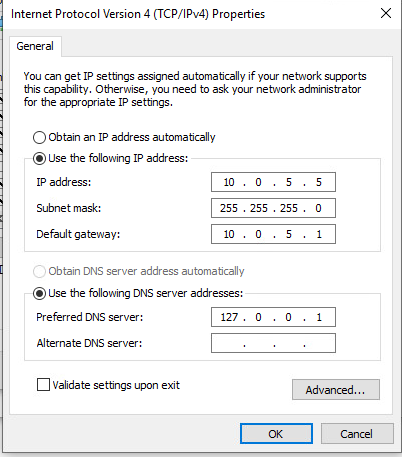

# Web Redundancy

Free and Open source high availability load balancer software (not hardware load balancer)

* reputation as fast, efficient, and stable
* typically installed on minimal Linux server install such as RHEL, CENTOS, Ubuntu


Keepalived

* relies on the well-known and widely used Linux Virtual Server (IPVS) kernel module, which provides Layer 4 load balancing
* Keepalived implements a set of health checkers to dynamically and adaptively maintain and manage load balanced server pools according to their health
* High availability is achieved by Virtual Redundancy Routing Protocol (VRRP), we used it for routers, now we are using it for our devices


HaProxy Lab:

Setting up Web02

<figure><figcaption></figcaption></figure>

```
sudo firewall-cmd --permanent --zone=public --add-port=80/tcp
sudo firewall-cmd --permanent --zone=public --add-port=22/tcp

Install httpd and enable
```

&#x20;

Setting up Ha1 + Ha2

Installing HaProxy and Keepalived: [https://sysadmins.co.za/achieving-high-availability-with-haproxy-and-keepalived-building-a-redundant-load-balancer/](https://sysadmins.co.za/achieving-high-availability-with-haproxy-and-keepalived-building-a-redundant-load-balancer/)


HA1 (MASTER)

<figure><figcaption></figcaption></figure>

\--

in the /etc/haproxy/haproxy.cfg add this:

<figure><figcaption></figcaption></figure>

in the /etc/keepalived/keepalived.conf

<figure><figcaption></figcaption></figure>

HA2 (BACKUP)

<figure><figcaption></figcaption></figure>

<figure><figcaption></figcaption></figure>

<figure><figcaption></figcaption></figure>

```
sudo systemctl start haproxy
sudo systemctl start keepalived
```

vyos1

```
set firewall name LAN-to-OPT default-action 'accept'
set firewall name OPT-to-LAN default-action 'accept'
set high-availability vrrp group LAN address 10.0.5.1/24
set high-availability vrrp group LAN interface 'eth1'
set high-availability vrrp group LAN priority '200'
set high-availability vrrp group LAN vrid '20'
set high-availability vrrp group OPT address 10.0.6.1/24
set high-availability vrrp group OPT interface 'eth2'
set high-availability vrrp group OPT priority '200'
set high-availability vrrp group OPT vrid '30'
set high-availability vrrp group WAN address 10.0.17.106/24
set high-availability vrrp group WAN interface 'eth0'
set high-availability vrrp group WAN priority '200'
set high-availability vrrp group WAN vrid '156'
set interfaces ethernet eth0 address '10.0.17.16/24'
set interfaces ethernet eth0 description 'SEC440-WAN'
set interfaces ethernet eth0 hw-id '00:50:56:a1:7d:9e'
set interfaces ethernet eth1 address '10.0.5.2/24'
set interfaces ethernet eth1 description 'SEC440-LAN'
set interfaces ethernet eth1 hw-id '00:50:56:a1:50:28'
set interfaces ethernet eth2 address '10.0.6.2/24'
set interfaces ethernet eth2 description 'SEC440-OPT'
set interfaces ethernet eth2 hw-id '00:50:56:a1:f3:af'
set interfaces loopback lo
set nat destination rule 30 description 'ssh-TO-web01'
set nat destination rule 30 destination address '10.0.17.106'
set nat destination rule 30 destination port '22'
set nat destination rule 30 inbound-interface 'eth0'
set nat destination rule 30 protocol 'tcp'
set nat destination rule 30 translation address '10.0.5.100'
set nat destination rule 30 translation port '22'
set nat destination rule 31 description 'http web forwarding'
set nat destination rule 31 destination address '10.0.17.106'
set nat destination rule 31 destination port '80'
set nat destination rule 31 inbound-interface 'eth0'
set nat destination rule 31 protocol 'tcp'
set nat destination rule 31 translation address '10.0.6.10'
set nat destination rule 31 translation port '80'
set nat source rule 10 description 'LAN to WAN'
set nat source rule 10 outbound-interface 'eth0'
set nat source rule 10 source address '10.0.5.0/24'
set nat source rule 10 translation address 'masquerade'
set nat source rule 20 description 'OPT to WAN'
set nat source rule 20 outbound-interface 'eth0'
set nat source rule 20 source address '10.0.6.0/24'
set nat source rule 20 translation address 'masquerade'
set protocols static route 0.0.0.0/0 next-hop 10.0.17.2
set service dns forwarding allow-from '10.0.5.0/24'
set service dns forwarding allow-from '10.0.6.0/24'
set service dns forwarding listen-address '10.0.5.1'
set service dns forwarding listen-address '10.0.6.1'
set service dns forwarding listen-address '10.0.6.2'
set service dns forwarding listen-address '10.0.5.2'
set service dns forwarding system
set service ssh listen-address '0.0.0.0'
set system config-management commit-revisions '100'
set system conntrack modules ftp
set system conntrack modules h323
set system conntrack modules nfs
set system conntrack modules pptp
set system conntrack modules sip
set system conntrack modules sqlnet
set system conntrack modules tftp
set system console device ttyS0 speed '115200'
set system host-name 'vyos01-fatima'
set system login user vyos authentication encrypted-password '$6$YUTCBnIl7XuxPfv7$UQXsMiDLSJsDs9mPJ2PQ.9IjjMks5MrKu6IlQRJsS.VIvkYeQXFvupJVrZMTQFYjkbTkRshVAYECJS337kHAS/'
set system login user vyos authentication plaintext-password ''
set system name-server '10.0.17.2'
```

vyos02

```
set high-availability vrrp group LAN address 10.0.5.1/24
set high-availability vrrp group LAN interface 'eth1'
set high-availability vrrp group LAN priority '100'
set high-availability vrrp group LAN vrid '20'
set high-availability vrrp group OPT address 10.0.6.1/24
set high-availability vrrp group OPT interface 'eth2'
set high-availability vrrp group OPT priority '100'
set high-availability vrrp group OPT vrid '30'
set high-availability vrrp group WAN address 10.0.17.106/24
set high-availability vrrp group WAN interface 'eth0'
set high-availability vrrp group WAN priority '100'
set high-availability vrrp group WAN vrid '156'
set interfaces ethernet eth0 address '10.0.17.76/24'
set interfaces ethernet eth0 description 'SEC440-WAN'
set interfaces ethernet eth0 hw-id '00:50:56:a1:8a:01'
set interfaces ethernet eth1 address '10.0.5.3/24'
set interfaces ethernet eth1 description 'SEC440-LAN'
set interfaces ethernet eth1 hw-id '00:50:56:a1:2c:00'
set interfaces ethernet eth2 address '10.0.6.3/24'
set interfaces ethernet eth2 description 'SEC440-OPT'
set interfaces ethernet eth2 hw-id '00:50:56:a1:93:78'
set interfaces loopback lo
set nat destination rule 30 description 'ssh-TO-web01'
set nat destination rule 30 destination address '10.0.17.106'
set nat destination rule 30 destination port '22'
set nat destination rule 30 inbound-interface 'eth0'
set nat destination rule 30 protocol 'tcp'
set nat destination rule 30 translation address '10.0.5.100'
set nat destination rule 30 translation port '22'
set nat source rule 10 description 'NAT FROM LAN to WAN'
set nat source rule 10 outbound-interface 'eth0'
set nat source rule 10 source address '10.0.5.0/24'
set nat source rule 10 translation address 'masquerade'
set nat source rule 20 description 'nat from opt-wan'
set nat source rule 20 outbound-interface 'eth0'
set nat source rule 20 source address '10.0.6.0/24'
set nat source rule 20 translation address 'masquerade'
set protocols static route 0.0.0.0/0 next-hop 10.0.17.2
set service dns forwarding allow-from '10.0.5.0/24'
set service dns forwarding allow-from '10.0.6.0/24'
set service dns forwarding listen-address '10.0.5.1'
set service dns forwarding listen-address '10.0.6.1'
set service dns forwarding listen-address '10.0.5.3'
set service dns forwarding listen-address '10.0.6.3'
set service dns forwarding system
set service ssh listen-address '0.0.0.0'
set system config-management commit-revisions '100'
set system conntrack modules ftp
set system conntrack modules h323
set system conntrack modules nfs
set system conntrack modules pptp
set system conntrack modules sip
set system conntrack modules sqlnet
set system conntrack modules tftp
set system console device ttyS0 speed '115200'
set system host-name 'vyos02-fatima'
set system login user vyos authentication encrypted-password '$6$YUTCBnIl7XuxPfv7$UQXsMiDLSJsDs9mPJ2PQ.9IjjMks5MrKu6IlQRJsS.VIvkYeQXFvupJVrZMTQFYjkbTkRshVAYECJS337kHAS/'
set system login user vyos authentication plaintext-password ''
set system name-server '10.0.17.2'

```
